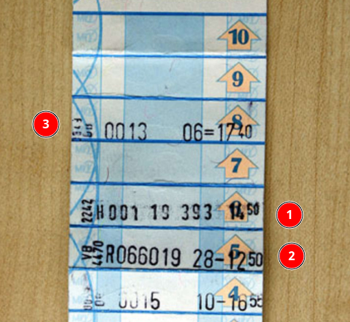

## Streifenkarte

Streifenkarte - это всего лишь один из способов оплаты за проезд. Во избежание путаницы с пробитием полосок рекомендуется использовать мобильные приложения от MVV/MVG.

Карта состоит из 10 полосок. В завимости от длины поездки и количества людей пробивается разное количество полосок, а некоторые из них пропускаются.

Официальная информация по тарифам [здесь](https://www.mvv-muenchen.de/tickets/tickets-tageskarten/streifenkarte/index.html)

### Особенности пробития полосок

#### Порядок

Полоски пробиваются по мере надобности по направлению с первой по десятую. Если на свежей карте пробить полоску номер 10, то погасятся сразу все 10 полосок, и карту можно выкинуть сразу после первого использования

#### Короткие и обычные поездки

Для обычной поездки в пределах Мюнхена (Fahrt in München, пример #3 на фото) нужно компостировать две полоски, причем первая из них должна быть пропущена. 

Например, едет один человек и у него уже погашены 6 полосок. Он должен прокомпостировать 8-ую полоску, пропустив 7-ую. В случае, если он прокомпостирует и 7-ую и 8-ую, оплата проезда не будет считаться за пределами Kurzestrecke. 

Для короткой поездки (Fahrt in der Kurzstrecke) компостируется одна полоска. Если едут несколько людей, то прокомпостировать нужно каждую из них на каждого человека. Например, едут два человека со свежей картой на короткое расстояние  - сначала пробивается полоска №1, потом полоска №2, пропускать нельзя

#### Поездка с детьми

По текущим правилам на ребенка компостируется одна полоска, независимо от расстояния.
Пример поездки с ребенком: один взрослый едет с ребенком в пределах Мюнхена. На руках карта на которой уже погашены 5 полоски. На ребенка компостируется полоска №6, на взрослого №8 (полоска №7 пропускается). Смотрите примеры #1 и #3 на картинке.

Пример поездки с ребенком на короткое расстояние (Kurzestrecke): На руках карта на которой уже погашены 4 полоски. На ребенка компостируется полоска №5, на взрослого №6 (пример #1 и #2 на фото )

## Велосипед

Смотри [соседнюю страницу](<./Велосипед (Fahrrad).md#Билеты>).